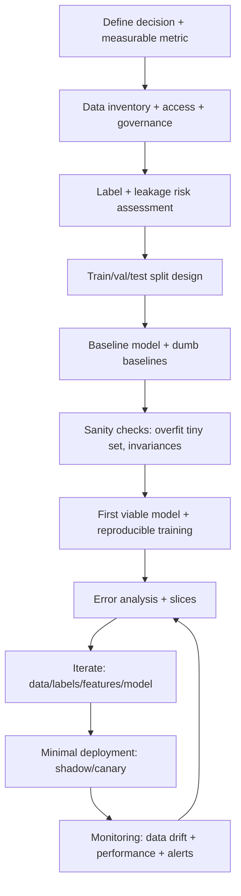
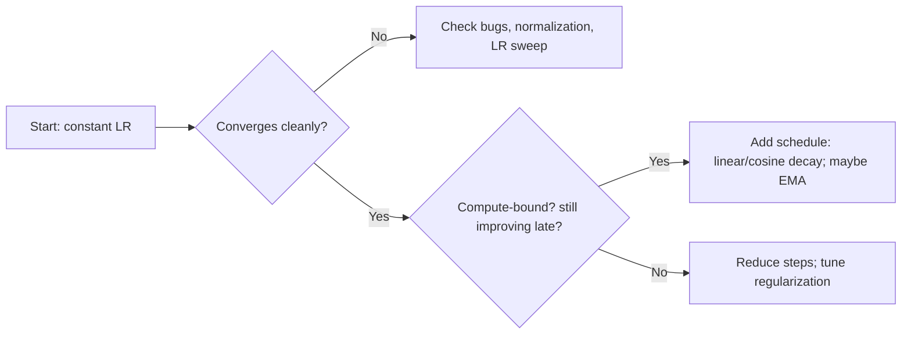

# Tacit Practitioner Knowledge for Greenfield Machine Learning Projects

## Executive summary

Greenfield ML projects succeed or fail less on “the right model” and more on: (a) whether the problem is operationally measurable, (b) whether the data pipeline is trustworthy end-to-end, and (c) whether iteration is fast and scientifically disciplined. This framing is explicit in entity["people","Martin Zinkevich","ml engineer"]’s engineering-oriented “Rules of Machine Learning,” which emphasizes metrics and pipeline solidity before sophistication, and in industry workflow research describing distinct, data-centric development stages and bottlenecks. citeturn11view0turn9search0

A widely-used pragmatic training posture is: **(1) get something that demonstrably overfits (prove the pipeline + model can learn), then (2) regularize toward generalization**—paired with aggressive sanity checks like “overfit one (tiny) batch” and “beat dumb baselines” before believing any improvement. entity["people","Andrej Karpathy","ml researcher"] popularized these checks in a compact practitioner playbook; similar “scientific method” framing (diagnose via curves; change one factor at a time) is formalized in the deep learning tuning playbook maintained by entity["company","Google","technology company"] researchers. citeturn10view2turn10view1turn10view0

For architecture-family selection, the dominant tacit heuristic is **“match inductive bias to data modality and data regime; default to strong, boring baselines”**: gradient-boosted trees remain extremely hard to beat on many medium-sized tabular datasets; Transformers dominate many text/sequence problems; CNN/ResNet-like backbones and ViT-style models cover most vision regimes; GNNs are appropriate when relational structure is causal and not easily featurized away. citeturn8search4turn6search4turn6search1turn6search3

Reinforcement learning is a special case: “it runs” is not evidence it works. RL outcomes are often high-variance across seeds and sensitive to implementation details, so practitioners treat **multi-seed evaluation + uncertainty reporting** as mandatory, and they debug by instrumenting environment dynamics, reward flow, and data distributions (replay, advantages) as much as the neural net. citeturn3search13turn16search4turn3search0turn3search6

Finally, early deployment discipline pays off immediately. ML systems incur unique “technical debt” (feedback loops, data dependency, entanglement, training-serving skew); a production-readiness rubric like the “ML Test Score” operationalizes this into concrete tests/monitors—even for teams “just starting out.” citeturn16search2turn16search5turn18search2

Assumption note: you did not specify domain constraints (latency, privacy, interpretability, regulation) or compute limits; the heuristics below assume **no hard constraints**. Where constraints commonly change decisions, they are called out explicitly. citeturn11view0turn10view1turn5search1

## Greenfield workflow and early project setup

Practitioners implicitly treat a greenfield ML effort as **two coupled products**: (1) the model, and (2) the measurement + data + deployment system that makes the model meaningful. The “Rules of Machine Learning” is blunt that most problems encountered are engineering problems; the practical recipe starts by making the pipeline solid, choosing a measurable objective, and iterating with simple features/models before complexity. citeturn11view0

Industry studies of teams shipping ML describe recurring stages and workflow differences vs traditional software (data management complexity, cross-functional skill requirements, and model/system entanglement). This matches the “feel” that early wins come from tightening the loop: instrument → collect → baseline → diagnose → iterate. citeturn9search0turn16search2



Two practitioner “meta-rules” repeatedly show up across influential guidance:

First, **front-load observability**. Instrument the current system early so you can accumulate historical data, define metrics without log archaeology, and run trustworthy evaluations (including A/B tests where relevant). citeturn11view0turn9search17

Second, **center the iteration loop on falsifiable diagnostics**. The tuning playbook encourages reading loss curves as “symptoms” (e.g., exploding or increasing training loss suggests a bug) and isolating variables (change one factor; use plots to compare hyperparameters without confounds). citeturn10view0turn10view1turn0search4

## Data and feature engineering heuristics and common data checks

A repeated (and under-taught) pattern is: **treat data quality as testable software behavior**. Tooling ecosystems such as TensorFlow Data Validation (schema/statistics/anomalies, drift/skew) and “unit-testing data” libraries like Deequ, along with expectation-driven frameworks like Great Expectations, embody this view. citeturn18search2turn2search21turn2search0turn2search12

### Common data checks that practitioners run early

The following checks are common because they catch “pipeline bugs masquerading as modeling problems,” a theme emphasized both in the “Rules of ML” (test infra separately; manually inspect inputs where possible) and in deep learning troubleshooting guidance. citeturn11view0turn10view0turn10view2

| Check | Why it’s high-leverage in greenfield work | Practical implementation cue | Source anchors |
|---|---|---|---|
| **Schema + type checks** (numeric vs categorical; ranges; allowed values) | Prevents silent shifts and broken joins; catches upstream contract changes early | Generate/infer schema from data; fail builds on anomalies | TFDV’s schema/anomaly approach citeturn18search2turn1search3 |
| **Missingness map** (overall + by slice/time) | Missing not at random often encodes process/failure states; can dominate signal | Track missing rates; create explicit missing indicators selectively | Great Expectations missingness guide citeturn2search0 |
| **Distribution checks + drift** | Data drift can break models; distribution bugs can be “almost invisible” | Compare histograms/quantiles over time; assert bounds | TFDV drift/skew; GX distribution validation citeturn18search2turn18search3 |
| **Train–serving skew checks** | A classic source of production failure: train features ≠ serving features | Compare training vs serving examples/statistics | TFDV skew detection; “Rules of ML” emphasis on training-serving skew citeturn18search2turn11view0 |
| **Leakage checks** (time leakage, target leakage, preprocessing leakage) | Leakage gives “great offline numbers” and terrible real behavior | Split before preprocessing; ensure feature generation policy matches inference-time availability | scikit-learn leakage guidance; CatBoost target leakage discussion citeturn12view0turn8search2 |
| **Group-level split integrity** (patient/user/device/session) | Duplicate entities across splits create hidden leakage and inflated metrics | Use group-aware splitters; verify no group overlap | GroupKFold/StratifiedGroupKFold docs citeturn18search0turn18search5 |
| **Label quality triage** (ambiguity, delay, noise, policy changes) | Labels are often a product of business processes; quality can dominate ceiling | Sample audit; agreement rates; time-alignment checks | “Rules of ML” focus on defining “good/bad” + pipeline trust citeturn11view0 |
| **Unit-testable constraints** (row count, uniqueness, referential integrity) | Many failures are simple ETL issues that should be caught like software regressions | Declarative constraints; fail pipeline on violations | Deequ “unit testing data” framing; Great Expectations validation citeturn2search21turn2search20 |

### Feature engineering heuristics that show up in practice

Many “feature tricks” are domain-specific, but several tacit patterns recur.

**Start by harvesting existing heuristics as features.** If a system already ranks, filters, or scores things with hand-built heuristics, those heuristics are often valuable raw signals. Practitioners frequently add the heuristic score directly as a feature first (for smooth migration), then refine/transforms later. citeturn11view0

**Be paranoid about target leakage in “clever encodings.”** Target statistics / mean encoding can leak label information if not computed strictly within folds or time; CatBoost’s work explicitly discusses target leakage risks for target statistics and proposes ordered schemes to mitigate it. citeturn8search2turn12view0

**Prefer “boring transformations” that linearize scale before exotic interactions.** Log/Box-Cox-like transforms for heavy tails, winsorization/clipping for extreme outliers, and monotonic transforms often pay off quickly, particularly for linear models and neural nets; tree ensembles are typically less sensitive but still benefit from leakage-safe, stable feature definitions. (This is a practitioner consensus pattern; the best support is that tree methods and neural nets have different inductive biases and failure modes on tabular data, including sensitivity to skewed/heavy-tailed distributions.) citeturn8search4turn8search15

**When data is scarce in vision/segmentation, lean on augmentation + inductive bias instead of architectural novelty.** U-Net’s original training strategy emphasizes strong augmentation to use limited labeled images effectively, and many modern vision recipes similarly treat augmentation as part of “the model.” citeturn15search5turn7search3

## Architecture-family selection mapped to problem types

A pragmatic architecture choice is rarely “the best model family in the abstract.” It is usually “the best family under your data modality, label availability, and iteration constraints,” consistent with the general lesson that scalable methods often beat hand-built knowledge in the long run. entity["people","Rich Sutton","rl researcher"] argued this historically (“The Bitter Lesson”). citeturn5search1

### Quick mapping table

| Problem/data type | Strong greenfield baseline | When to escalate | Typical escalation targets | Primary anchors |
|---|---|---|---|---|
| **Medium-size tabular** (≈10k–1M rows, mixed types) | Gradient-boosted trees (XGBoost/LightGBM/CatBoost-style) | If you have very large data, complex interactions across modalities, or need representation learning | TabTransformer-like models; hybrid tabular+text/image; feature embeddings | Tabular benchmarks show tree ensembles stay SOTA on many medium-size datasets citeturn8search4turn5search6turn5search11turn8search6 |
| **Text / NLP** (classification, extraction, QA) | Fine-tune a pretrained Transformer encoder | If domain shift is big or you need generation / retrieval-augmented behavior | Larger pretrained models; instruction-tuned; retrieval systems | Transformer architecture citeturn6search4; BERT-style pretraining/fine-tuning citeturn15search0 |
| **General sequence modeling** (translation, time-dependent tokens) | Transformer | If long context, multi-modal, or latency constraints | Sparse/efficient attention variants; distillation | “Attention Is All You Need” citeturn6search4 |
| **Image classification** | ResNet-like CNN with modern training recipe | If abundant data/compute or you want unified transformer backbone across tasks | ViT-class models; convnext-like; SSL pretraining | ResNet citeturn6search1; ViT citeturn6search2 |
| **Segmentation** | U-Net family (often with strong augmentation) | If you need SOTA on large-scale or multi-domain | U-Net + stronger encoder (CNN/ViT), multi-scale heads | U-Net citeturn15search5 |
| **Graph-structured** (node/link prediction) | Simple GCN baseline | If graph is heterogeneous/large or attention helps | GAT, message-passing variants; sampling methods | GCN citeturn6search3; GAT citeturn15search3 |
| **Object detection** | Start from a standard detection framework | If latency/accuracy tradeoffs demand it | Faster R-CNN-style vs one-stage detectors | Faster R-CNN citeturn15search18 |
| **RL (online control)** | PPO (robust) or SAC (continuous, sample-efficient off-policy) | If sample efficiency, stability, or offline constraints dominate | Model-based RL; offline RL; large-scale distributed variants | PPO citeturn4search4; SAC citeturn3search11; Spinning Up algorithm notes citeturn3search0 |

image_group{"layout":"carousel","aspect_ratio":"16:9","query":["transformer architecture schematic diagram","residual network resnet diagram","graph neural network message passing diagram","gradient boosted decision trees ensemble diagram"],"num_per_query":1}

### Architecture selection decision flow

```mermaid
flowchart TD
  A[What is the dominant input modality?] --> B{Tabular?}
  B -- Yes --> B1[Start with gradient-boosted trees]
  B -- No --> C{Text / tokens?}
  C -- Yes --> C1[Start with pretrained Transformer encoder]
  C -- No --> D{Images/video?}
  D -- Yes --> D1[Start with ResNet-style CNN or ViT if data/compute large]
  D -- No --> E{Graph structure is essential?}
  E -- Yes --> E1[Start with GCN baseline; add attention if needed]
  E -- No --> F{Sequential decision making with feedback?}
  F -- Yes --> F1[RL: PPO (robust) / SAC (continuous)]
  F -- No --> G[Start with simplest model that matches constraints]
  B1 --> H[Only escalate if baseline is bottlenecked by representation]
  C1 --> H
  D1 --> H
  E1 --> H
  F1 --> H
```

A tacit but crucial addendum: if two model families are close, **pick the one with the easiest debugging story** (interpretable errors, stable training, strong tooling). This is aligned with the “don’t be a hero / copy the simplest related architecture first” advice and the tuning playbook’s emphasis on simple initial configurations. citeturn10view2turn10view1

## Hyperparameter and training-setup heuristics

This section summarizes “what practitioners do first” to get a working model quickly, and “what they do next” to make results reliable.

### The minimum set of sanity checks before tuning anything

**Overfit a tiny subset (or a single batch).** If you cannot drive training loss near zero on a tiny dataset, you likely have a bug (data/labels/architecture/optimizer). This check is singled out as a core early-stage technique in practitioner guidance. citeturn10view2

**Beat dumb baselines (and an input-independent baseline).** Before caring about SOTA, you should beat: predicting the marginal label distribution, a simple heuristic, and a basic classical model if available. citeturn10view2turn11view0

**Treat “training loss rising” as a bug until proven otherwise.** The tuning playbook explicitly flags unexpected curve behaviors (like increasing training loss) as indicative of pipeline issues. citeturn10view0turn10view1

### Practical default choices and why they work

**Start with a simple configuration and add complexity only when you have a stable baseline.** This is a repeated theme: your initial setup should be “simple, relatively fast, relatively low resource,” and you can add “bells and whistles” later once you know they’re worth it. citeturn10view1turn11view0

**Batch size is usually an engineering choice, not a modeling choice.** The tuning playbook argues you should generally pick batch size for throughput (largest feasible that actually speeds training), and not treat it as a direct knob for validation performance; changing batch size typically forces retuning learning rate and regularization. citeturn10view1

**Learning-rate strategy: start simple, then schedule.** A common workflow is constant LR → basic linear/cosine decay if needed; complicated schedules often emerge from ad hoc tuning, and the playbook recommends defaulting to linear or cosine decay. citeturn10view1



**Adam as a “get it working” optimizer; SGD for some vision baselines when you have time to tune.** A common practitioner claim is that Adam is forgiving early; entity["people","Andrej Karpathy","ml researcher"] suggests Adam with LR ≈ 3e-4 as a safe starting point for baselines, while noting that well-tuned SGD often slightly wins for ConvNets but is fussier. citeturn10view2

**Scaling batch size: linear LR scaling + warmup is a proven recipe under large batches.** Large-minibatch training work shows that scaling LR with batch size and using warmup can recover accuracy at very large batches (e.g., training ResNet-50 at batch 8192 without accuracy loss under their recipe). citeturn7search1

**Prefer decoupled weight decay for adaptive optimizers (AdamW).** The AdamW paper argues L2 regularization and weight decay are not equivalent for Adam-like optimizers and proposes decoupling; this has become a standard default in modern deep learning training. citeturn7search2

**Mixed precision is often “free speed” if you do it correctly.** Mixed-precision training work and practical GPU guidance describe techniques like loss scaling and maintaining FP32 master weights to preserve accuracy while using FP16 activations/gradients. citeturn16search3turn16search17

**Reproducibility knobs matter for debugging.** When you are still trying to establish sanity (not peak throughput), deterministic settings and controlled randomness reduce the time to isolate bugs; PyTorch documents tradeoffs among cuDNN benchmarking and deterministic settings, and TensorFlow exposes op determinism controls. citeturn17search0turn17search20

### Typical initial hyperparameter ranges (practitioner starting points)

These are **starting envelopes**, not guaranteed-optimal ranges; they reflect common defaults from widely used reference implementations and playbooks, and they are safest when combined with the sanity checks above. citeturn10view1turn10view2turn20view0turn25view0

| Family | Key knobs to set first | Typical starting point | Typical search window (early) | Source anchors |
|---|---|---|---|---|
| **GBDT (XGBoost/LightGBM/CatBoost-style)** | learning_rate, max_depth/depth, subsample/feature_fraction, num_leaves, regularization | learning_rate 0.03–0.1; depth 4–10; subsample/colsample 0.6–1.0 | learning_rate 0.01–0.3; depth 3–12; subsample/colsample (0,1] | Parameter domains / tuning considerations in official docs citeturn14search0turn14search1turn14search2 |
| **CNN (vision baseline)** | optimizer, LR, weight decay, augmentation strength, schedule | SGD+momentum or Adam; start with simple schedule | LR sweep over ~1–2 orders of magnitude; add cosine/linear decay | “Bag of Tricks” highlights training refinements; tuning playbook on schedules citeturn7search3turn10view1 |
| **Transformer encoder fine-tune** | AdamW LR, weight decay, warmup, dropout | Adam-family with LR often in the 1e-5–5e-4 scale depending on size/data; warmup when unstable | LR ×/÷ 3–10; weight decay broad (0–0.1) | Transformer + BERT pretraining/fine-tuning paradigm; tuning playbook approach citeturn6search4turn15search0turn10view1 |
| **PPO (RL)** | clip_ratio, policy/value LR, gamma, lambda, KL target | clip_ratio 0.2 (often 0.1–0.3); pi_lr 3e-4; vf_lr 1e-3; gamma 0.99; target_kl 0.01 | clip_ratio 0.1–0.3; LR ×/÷ 3–10; gamma 0.95–0.999 | Spinning Up PPO reference implementation defaults + comments citeturn20view0 |
| **SAC (RL continuous)** | lr, alpha, polyak, replay size, batch size, start_steps | lr 1e-3; alpha 0.2; polyak 0.995; replay 1e6; batch 100; start_steps 10000 | lr ×/÷ 3; alpha task-dependent; polyak 0.99–0.999 | Spinning Up SAC reference implementation defaults citeturn25view0 |

## Reinforcement learning best practices and debugging heuristics

Practical RL work differs from supervised ML because you debug a **closed-loop system**: your policy changes the data distribution it trains on. Tacit best practice is to make experimentation unusually rigorous and over-instrumented, because variance and hidden confounds are severe. citeturn3search13turn16search4

### Algorithm-choice heuristics practitioners actually use

**PPO as “first robust policy optimizer.”** PPO’s appeal is a simple, first-order method that empirically performs well across diverse tasks and avoids catastrophic policy updates via clipping. citeturn4search4turn23search5

**SAC for continuous control when sample efficiency matters.** SAC optimizes an entropy-regularized objective and is off-policy, typically giving better sample efficiency than on-policy methods in continuous control; the SAC line of work also emphasizes brittleness to hyperparameters and introduces automatic temperature adjustments in later variants. citeturn3search11turn3search3

**DQN family for discrete actions with replay + target networks.** DQN established a canonical recipe (experience replay + target network) that remains foundational for discrete control baselines. citeturn4search1

Spinning Up also documents practical constraints like “SAC implementation here is for continuous action spaces,” which matters when choosing a baseline. citeturn23search2

### Debugging loop: what experienced RL practitioners check first

**Treat the environment as suspect.** Many “RL bugs” are environment contract bugs: incorrect termination signals, reward scaling issues, action bounds, observation units, or non-stationary resets. Spinning Up’s code and docs encourage explicit choices like random action warm-start (`start_steps`) for exploration and deterministic evaluation episodes, which are also sanity checks that the environment behaves as expected. citeturn25view0turn24search14

**Instrument learning signals, not just return.** Logging Q-values, policy entropy/log-prob, advantage statistics, replay buffer occupancy, and KL (for PPO-like methods) turns “it’s unstable” into a debuggable hypothesis. Spinning Up’s reference implementations explicitly compute and log KL, entropy, clip fraction, losses, etc., which reflects what practitioners monitor. citeturn20view0turn25view0

**Implementation details matter enough to dominate algorithm choice.** Practitioner and community analyses emphasize that “PPO” is not one thing; small details (advantage normalization, value clipping, schedule choices) can change results, motivating checklists of implementation details. citeturn3search6turn19search12

### Evaluation rigor everyone learns the hard way

**Multi-seed evaluation is not optional.** “Deep RL that Matters” and later work show large variance across trials and argue many seeds are required for comparisons; “Statistical Precipice” argues few-run regimes produce misleading point-estimate conclusions and advocates interval/robust aggregates (e.g., IQM). citeturn3search13turn16search4turn16search0

## Evaluation and validation shortcuts

Experienced practitioners use “shortcuts” not to cheat, but to quickly falsify wrong hypotheses.

### Fast sanity tests that catch most issues

**Overfit-on-tiny-data.** This is the quickest end-to-end test that your model can represent the mapping and that your pipeline (labels, loss, optimizer, batching) is wired correctly. citeturn10view2

**Random-label test (capacity + pipeline sanity).** If a deep model cannot fit random labels on the training set, you may have an optimization/pipeline issue; the classic generalization paper demonstrates modern nets can fit random labels easily, so failure to do so is suspicious. citeturn13search0

**Leakage audit via “too-good-to-be-true” signals.** If a model hits implausibly high offline performance quickly, prioritize leakage: preprocessing on full data, entity overlap between splits, target leakage features, and temporal leakage. scikit-learn’s guidance is explicit: split before preprocessing; never `fit` transforms on test data; pipelines help prevent leakage. citeturn12view0turn18search0turn13search2

**Time-respecting validation for time-dependent problems.** For forecasting or anything where “future data” would not be available, use time-ordered splits (e.g., TimeSeriesSplit) rather than shuffled CV. citeturn13search2turn2search7

### Slice-based evaluation and “unknown unknowns”

**Evaluate by slices, not only overall metrics.** Many failures are localized: demographics, regions, devices, cohorts, or rare-but-important segments. Tooling like Fairness Indicators (built on TFMA) exists precisely to compute metrics across slices at scale and visualize them. citeturn19search3turn14search3turn14search15

**Calibration checks when probabilities matter.** Modern neural networks are often miscalibrated; temperature scaling is a simple, effective post-processing calibration method in many settings. This matters for thresholding, ranking, and any decision that interprets predicted probabilities. citeturn13search1

**Assume underspecification until proven otherwise.** Even when multiple predictors have equivalent held-out performance, they may behave very differently under deployment shifts; this is framed as “underspecification” in modern ML credibility work, and it motivates robustness checks beyond IID validation. citeturn5search0

### Practical validation heuristics for “greenfield reality”

A pragmatic validation ladder (commonly used in industry) is:

1) **IID validation** (standard split).  
2) **Group-aware / time-aware validation** (prevent leakage).  
3) **Simulated deployment shift** (later time window; new geography; new device).  
4) **Shadow deployment** (model predicts but does not act).  
5) **Canary / controlled rollout** (model acts for a small fraction).  

This ladder mirrors the warning that ML systems accrue special technical debt and hidden feedback loops and therefore require monitoring beyond offline metrics. citeturn16search2turn16search5turn9search17

## Deployment, monitoring, pitfalls, and checklists

### Deployment and monitoring considerations for early-stage models

Greenfield deployments often start as “shadow mode” or “assistive mode,” where predictions are logged and compared to existing decisions. This aligns with the engineering-forward guidance to keep the first model simple, focus on infrastructure, and ensure training and serving agree. citeturn11view0turn16search5

Three monitoring layers are unusually high-leverage early:

**Data contract monitoring (schema + anomalies + drift).** Catch upstream changes before they hit model performance; TFDV explicitly targets anomalies, training-serving skew, and drift detection. citeturn18search2turn1search3turn1search15

**Prediction monitoring (distribution + calibration + slices).** Monitor score distributions, class balance, and slice performance; slice-based evaluation tools exist because global metrics hide regressions. citeturn14search3turn13search1

**Outcome monitoring (delayed labels + feedback loops).** Technical debt work highlights hidden feedback loops and entanglement, meaning the system can silently change the data it trains on (e.g., recommender systems). citeturn16search2turn16search10

### Common pitfalls and mitigation strategies

**Training–serving skew.** Mitigate by sharing feature code, validating statistics between train and serve, and adding explicit skew monitors. citeturn11view0turn18search2

**Data leakage (especially via preprocessing and grouping).** Mitigate via strict split discipline, pipelines, and group/time splitters; treat any suspiciously strong offline result as a leakage alarm until disproven. citeturn12view0turn18search0turn13search2

**Hidden technical debt (entanglement, undeclared consumers, feedback loops).** Mitigate by versioning data/features/models, writing tests/monitors, and simplifying interfaces; the technical debt paper enumerates these ML-specific risk factors. citeturn16search2turn16search5

**Underspecification (many “equally good” models that behave differently under shift).** Mitigate with stress tests, slice evaluation, and stability checks across retrains/seeds. citeturn5search0turn3search13

**Non-reproducible experimentation.** Mitigate with deterministic settings when debugging, stable seeds, and experiment tracking of configs/artifacts. PyTorch documents randomness sources and relevant flags; MLflow and W&B describe experiment tracking workflows and lineage/versioning. citeturn17search0turn17search3turn17search2

### Concise actionable checklists

These are intentionally “operator checklists”—small enough to actually use.

**Day-zero project checklist (before modeling):**
- Define a decision, not a dataset; write the success metric(s) and failure metric(s). citeturn11view0  
- Confirm label availability, delay, and policy that generates labels; document leakage risks. citeturn11view0turn8search2  
- Design the split strategy that matches deployment (time/group/region). citeturn13search2turn18search0  
- Build a baseline + dumb baselines; ensure you can reproduce evaluation reliably. citeturn10view2turn10view1  

**Data readiness checklist (run on every new data drop):**
- Schema/type/range checks; categorical domain changes. citeturn18search2turn1search3  
- Missingness and distribution drift dashboards (overall + key slices). citeturn2search0turn18search3  
- Train–serving skew comparison. citeturn18search2  
- Group and time leak detection (no overlap across splits). citeturn18search0turn12view0  

**Training/debugging checklist (when “it won’t learn”):**
- Overfit one batch / tiny dataset; if fails, treat as bug. citeturn10view2  
- Check loss curve pathologies (loss increasing, divergence) as pipeline issues. citeturn10view0turn10view1  
- Confirm preprocessing parity between train/val/test (no `fit` on test). citeturn12view0  
- Freeze randomness (determinism) to isolate changes; unfreeze later for speed. citeturn17search0turn17search20  

**RL debugging checklist (when return is unstable):**
- Run multi-seed; report uncertainty (not single “best run”). citeturn3search13turn16search4  
- Log entropy/KL/advantages/Q stats; verify exploration warm-start where appropriate. citeturn25view0turn20view0  
- Validate environment termination/reward scales; test deterministic evaluation episodes. citeturn25view0turn24search14  

**Early deployment checklist (minimum viable safety):**
- Implement ML Test Score-style tests: data tests, model tests, infra tests, monitoring. citeturn16search5  
- Start with shadow or canary rollout; monitor drift/skew and slice regressions. citeturn18search2turn14search3  
- Track experiments/models with lineage/versioning (config + artifacts). citeturn17search3turn17search2  

### Short examples (how these heuristics play out)

**Example: greenfield churn prediction (tabular).** Start with a boosted-tree baseline because it is typically strong on medium-sized tabular data; design group/time splits to prevent leakage; add schema + drift tests; only move to deep tabular Transformers if you have enough data or multimodal features that require representation learning. citeturn8search4turn18search0turn18search2turn8search1

**Example: customer support ticket triage (text).** Baseline with fine-tuning a pretrained Transformer encoder; validate calibration if thresholds drive actions; run slice metrics by language/region/product line; deploy in shadow mode first to detect distribution shift. citeturn6search4turn13search1turn14search3turn11view0

**Example: continuous control policy for a simulator (RL).** Pick SAC for continuous actions; use the reference hyperparameters as a starting point; evaluate across seeds and report uncertainty; debug by logging Q/entropy, and ensure deterministic test episodes and correct termination/reward semantics. citeturn3search11turn25view0turn3search13turn16search4

### Selected primary and practitioner sources with links

Rules of Machine Learning (Best Practices for ML Engineering) — https://developers.google.com/machine-learning/guides/rules-of-ml citeturn11view0  
Deep Learning Tuning Playbook (living playbook + scientific method) — https://developers.google.com/machine-learning/guides/deep-learning-tuning-playbook citeturn0search4turn10view0  
Deep Learning Tuning Playbook repository — https://github.com/google-research/tuning_playbook citeturn10view1  
A Recipe for Training Neural Networks — https://karpathy.github.io/2019/04/25/recipe/ citeturn10view2  
Hidden Technical Debt in Machine Learning Systems — https://research.google/pubs/hidden-technical-debt-in-machine-learning-systems/ citeturn16search2  
The ML Test Score (production readiness rubric) — https://research.google/pubs/the-ml-test-score-a-rubric-for-ml-production-readiness-and-technical-debt-reduction/ citeturn16search5  
Software Engineering for Machine Learning: A Case Study — https://www.microsoft.com/en-us/research/wp-content/uploads/2019/03/amershi-icse-2019_Software_Engineering_for_Machine_Learning.pdf citeturn9search0  
Spinning Up in Deep RL — https://spinningup.openai.com/en/latest/ citeturn3search0  
Spinning Up PPO implementation defaults — https://spinningup.openai.com/en/latest/_modules/spinup/algos/pytorch/ppo/ppo.html citeturn20view0  
Spinning Up SAC implementation defaults — https://spinningup.openai.com/en/latest/_modules/spinup/algos/pytorch/sac/sac.html citeturn25view0  
Deep Reinforcement Learning that Matters — https://ojs.aaai.org/index.php/AAAI/article/view/11694 citeturn3search13  
Deep RL at the Edge of the Statistical Precipice — https://arxiv.org/abs/2108.13264 citeturn16search4  
The 37 Implementation Details of PPO — https://iclr-blog-track.github.io/2022/03/25/ppo-implementation-details/ citeturn3search6  
XGBoost (paper) — https://arxiv.org/abs/1603.02754 citeturn5search6  
LightGBM (paper page) — https://papers.nips.cc/paper/6907-lightgbm-a-highly-efficient-gradient-boosting-decision-tree citeturn5search11  
CatBoost (paper) — https://arxiv.org/abs/1706.09516 citeturn8search6  
Why do tree-based models still outperform deep learning on tabular data? — https://papers.neurips.cc/paper_files/paper/2022/file/0378c7692da36807bdec87ab043cdadc-Paper-Datasets_and_Benchmarks.pdf citeturn8search4  
Attention Is All You Need — https://arxiv.org/abs/1706.03762 citeturn6search4  
ResNet — https://arxiv.org/abs/1512.03385 citeturn6search1  
Vision Transformer — https://arxiv.org/abs/2010.11929 citeturn6search2  
GCN — https://arxiv.org/abs/1609.02907 citeturn6search3  
Graph Attention Networks — https://arxiv.org/abs/1710.10903 citeturn15search3  
On Calibration of Modern Neural Networks — https://arxiv.org/abs/1706.04599 citeturn13search1  
Underspecification Presents Challenges for Credibility in Modern ML — https://arxiv.org/abs/2011.03395 citeturn5search0  
TFDV guide (schema, drift, skew, anomalies) — https://www.tensorflow.org/tfx/guide/tfdv citeturn18search2  
Great Expectations missingness — https://docs.greatexpectations.io/docs/reference/learn/data_quality_use_cases/missingness/ citeturn2search0  
Deequ unit testing data — https://www.amazon.science/publications/unit-testing-data-with-deequ citeturn2search21  
scikit-learn common pitfalls (leakage, pipelines, randomness) — https://scikit-learn.org/stable/common_pitfalls.html citeturn12view0  
entity["people","Martin Fowler","software engineer"]: Continuous Delivery for Machine Learning — https://martinfowler.com/articles/cd4ml.html citeturn9search17  
MLOps: Continuous delivery and automation pipelines — https://docs.cloud.google.com/architecture/mlops-continuous-delivery-and-automation-pipelines-in-machine-learning citeturn9search1